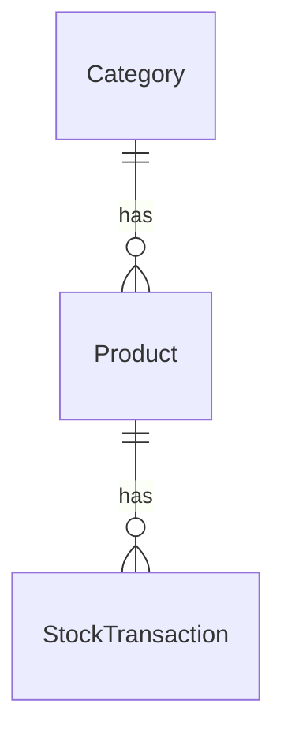

# Project Overview

Inventory Management REST API built with Spring Boot.

## Features

- JWT Authentication
- Product Management
- Category Management
- Stock Tracking
- Low Stock Alerts
- Reporting API

## Tech Stack

- Java 21
- Spring Boot
- PostgreSQL
- Spring Security
- JWT
- Maven

## ERD



## Run Locally

```bash
git clone https://github.com/prxsss/inventory-api.git
docker compose -f .\compose.dev.yaml up -d
mvn spring-boot:run
```

## API Documentation

[Swagger UI](http://localhost:8080/swagger-ui/index.html)
