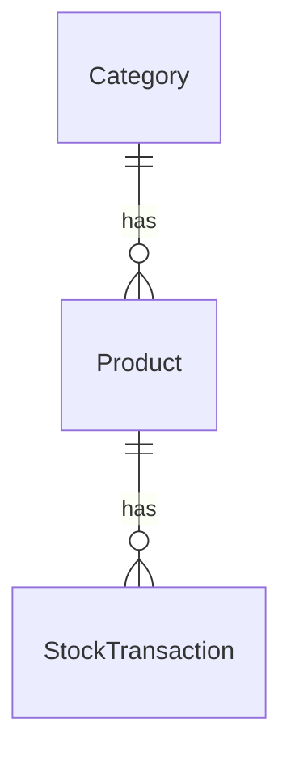

# Project Overview

Inventory Management REST API built with Spring Boot.

## Table of Contents

- [Features](#features)
- [Tech Stack](#tech-stack)
- [Prerequisites](#prerequisites)
- [Local Development](#local-development)
- [Production](#production)
- [ERD](#erd)
- [Authentication](#authentication)
- [API Documentation](#api-documentation)

## Features

- JWT Authentication
- Product Management
- Category Management
- Stock Tracking
- Low Stock Alerts
- Reporting API

## Tech Stack

- Java 21
- Spring Boot
- PostgreSQL
- Spring Security
- JWT
- Maven
- Docker

## Prerequisites

Make sure you have the following installed before running the project:

- [Java 21](https://adoptium.net/)
- [Maven 3.9+](https://maven.apache.org/download.cgi)
- [Docker & Docker Compose](https://www.docker.com/)

## Local Development

**1. Clone the repository**

```bash
git clone https://github.com/prxsss/inventory-api.git
cd inventory-api
```

**2. Configure the development profile**

```bash
cp src/main/resources/application-dev.properties.example src/main/resources/application-dev.properties
```

Edit [`src/main/resources/application-dev.properties`](src/main/resources/application-dev.properties) and set the local database and JWT values. Use [`application-dev.properties.example`](src/main/resources/application-dev.properties.example) as the reference configuration.

The default active profile is `dev`. Make sure Docker is running, then start Spring Boot:

```bash
./mvnw spring-boot:run
```

Spring Boot Docker Compose support automatically starts the PostgreSQL service defined in `compose.yaml`. You do not need to run Docker Compose separately.

> `compose.yaml` currently reads `POSTGRES_DB`, `POSTGRES_USER`, and `POSTGRES_PASSWORD` from a root `.env` file. These values must match the datasource values in `application-dev.properties`.

The API will be available at `http://localhost:8080`.

## Production

**1. Configure environment variables**

```bash
cp .env.example .env
```

Edit `.env` with the production database and JWT values:

```env
DB_URL=jdbc:postgresql://your-db-host:5432/inventory_db
DB_USERNAME=your_db_user
DB_PASSWORD=your_db_password
JWT_SECRET=your_production_jwt_secret
JWT_EXPIRATION_MS=86400000
```

**2. Build and run the production container**

```bash
docker compose -f compose.prod.yaml up -d
```

The Compose configuration sets `SPRING_PROFILES_ACTIVE=prod` and passes the values from `.env` to the application container. The production database must already be available at `DB_URL`.

## ERD



## Authentication

This API uses **JWT Bearer Token** authentication.

**1. Register a new account**

```http
POST /api/auth/register
Content-Type: application/json

{
  "name": "your_name",
  "email": "your_email@example.com",
  "password": "your_password"
}
```

**2. Login to get a token**

```http
POST /api/auth/login
Content-Type: application/json

{
  "email": "your_email@example.com",
  "password": "your_password"
}
```

**3. Use the token in subsequent requests**

```http
GET /api/products
Authorization: Bearer <your_token_here>
```

## API Documentation

```
http://localhost:8080/swagger-ui/index.html
```
