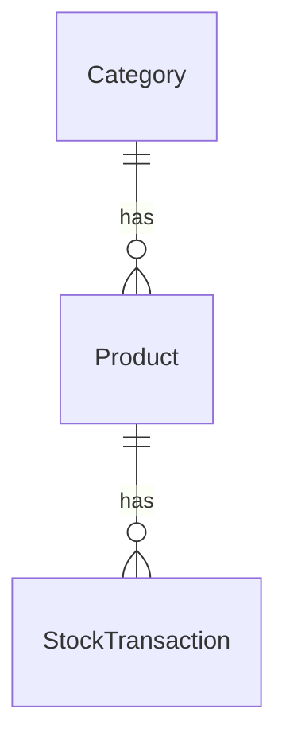

# Project Overview

Inventory Management REST API built with Spring Boot.

## Table of Contents

- [Features](#features)
- [Tech Stack](#tech-stack)
- [Prerequisites](#prerequisites)
- [Getting Started](#getting-started)
- [Environment Variables](#environment-variables)
- [ERD](#erd)
- [Authentication](#authentication)
- [API Documentation](#api-documentation)

## Features

- JWT Authentication
- Product Management
- Category Management
- Stock Tracking
- Low Stock Alerts
- Reporting API

## Tech Stack

- Java 21
- Spring Boot
- PostgreSQL
- Spring Security
- JWT
- Maven
- Docker

## Prerequisites

Make sure you have the following installed before running the project:

- [Java 21](https://adoptium.net/)
- [Maven 3.9+](https://maven.apache.org/download.cgi)
- [Docker & Docker Compose](https://www.docker.com/)

## Getting Started

**1. Clone the repository**

```bash
git clone https://github.com/prxsss/inventory-api.git
cd inventory-api
```

**2. Configure environment variables**

```bash
cp .env.example .env
```

Then edit `.env` with your own values (see [Environment Variables](#environment-variables)).

**3. Start the database**

```bash
docker compose -f compose.dev.yaml up -d
```

**4. Run the application**

```bash
mvn spring-boot:run
```

## Environment Variables

Create a `.env` file in the project root based on `.env.example`:

```env
# Database
DB_HOST=localhost
DB_PORT=5432
DB_NAME=inventory_db
DB_USERNAME=your_db_user
DB_PASSWORD=your_db_password

# JWT
JWT_SECRET=your_jwt_secret_key
JWT_EXPIRATION_MS=86400000
```

The API will be available at `http://localhost:8080`

## ERD



## Authentication

This API uses **JWT Bearer Token** authentication.

**1. Register a new account**

```http
POST /api/auth/register
Content-Type: application/json

{
  "name": "your_name",
  "email": "your_email@example.com",
  "password": "your_password"
}
```

**2. Login to get a token**

```http
POST /api/auth/login
Content-Type: application/json

{
  "email": "your_email@example.com",
  "password": "your_password"
}
```

**3. Use the token in subsequent requests**

```http
GET /api/products
Authorization: Bearer <your_token_here>
```

## API Documentation

```
http://localhost:8080/swagger-ui/index.html
```
